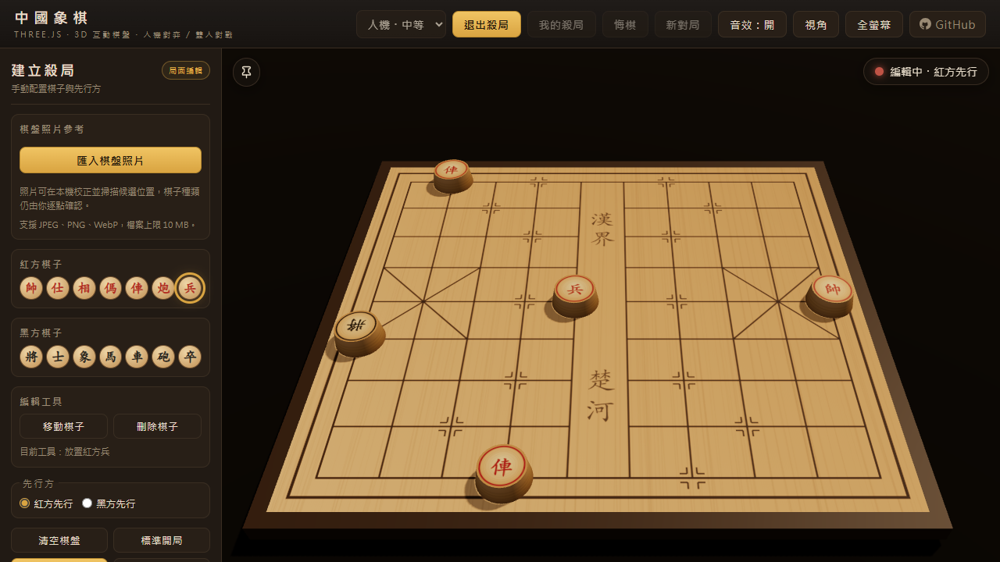

# 中國象棋殺局訓練 · Mate Puzzle Training

本專案是 [doggy8088/chinese-chess](https://github.com/doggy8088/chinese-chess) 的非官方衍生／擴充，在原有 Three.js 3D 中國象棋、雙人對弈與三級 AI 上，加入殺局建立與反覆練習。

主要用途是手動建立已知的殺局局面、錄製一條合法且以將死結束的解答，並反覆練習該條錄製路線。

> **手動擺盤 → 確認局面 → 錄製答案 → 開始練習 → 完成殺局**

## 線上試玩

本衍生專案已部署於 GitHub Pages：<https://robinlee0929.github.io/chinese-chess-training/>

<p align="center">
  
</p>

## Quick Start

```bash
git clone https://github.com/Robinlee0929/chinese-chess-training.git
cd chinese-chess-training
python -m http.server 8000
```

開啟 <http://127.0.0.1:8000/>。

## 核心功能

- **手動擺盤**：「建立殺局」→ 選擇紅／黑棋子並擺盤 → 設定先行方 →「確認局面」。可移動、刪除棋子或清空棋盤；確認時要求雙方各有一將／帥。
- **解答錄製**：依序走出雙方已知解法，可退回一著或重新錄製。所有著法交由既有 `game.js` 規則引擎檢查；只有合法且最後形成將死的答案可儲存。
- **殺局練習**：玩家操作先行方，對手依已錄製的單一路線回應。合法但不符答案的著法會記為錯誤且不改變棋盤；可重新開始練習。玩家可自行按「提示」，依序只揭示目前錄製著法的棋種 → 起點 → 目標 → 完整棋譜記法；提示不會自動出現，也不是 AI／求解器產生。已儲存題目保留練習／完成次數與最近練習時間；每次開始或重新開始計一次練習，走完答案計一次完成。
- **已完成棋局複盤與臨時分析**：終局後可直接從最後一手開啟唯讀複盤，也可從「對局紀錄」載入本機保存的棋局；支援第一手／上一手／下一手／最後一手、完整著法清單與直接跳轉。非終局位置可選「從這裡分析」，以該著的確定性重播快照與歷史重複局面前綴開始臨時試走，並可悔棋、重置或返回原複盤著數；也可明確按「AI 分析」，由獨立背景搜尋顯示一個不含分數的候選著法與完成深度。候選完成後，畫面會以同一個複盤前置局面，比較棋譜中實際下一著與 AI 候選的立即吃子、將軍、終局與合法回應等規則事實；比較不會另做 AI 搜尋，也不評斷好壞。若這些事實符合明確的本機規則，畫面會另顯示最多一則簡短「教學提示」；這則 R3C-1 本機文字始終是 canonical 教學。R3C2-A2 另提供預設關閉、只供注入 mock requester 驗證的「AI 教練再說明」介面；目前沒有真實 LLM／API、後端、供應商或網路請求，失敗時原教學提示保持不變。兩種分析、事實比較與教學提示都不建立新棋譜，也不寫入棋局／題目／練習分析；離開後會回復原本的即時棋局畫面。
- **瀏覽器本機練習紀錄（非遙測）**：已儲存題目的完成或明確中止會留下精簡嘗試摘要與累計數字，每題只保留最近 10 次摘要，較舊摘要淘汰後累計數字仍保留。摘要只有完成／中止、開始／結束時間、錯誤數與提示請求次數／最高提示級別；不保存逐著歷史、棋盤、解答或提示內容，不匯出也不上傳。分頁在未完成時直接關閉或重新載入，該次可能不會留下紀錄；刪除題目後也會嘗試清除其本機練習紀錄。

## 附加功能

- **我的殺局／本機題庫**：為完成的答案命名並儲存在 `localStorage`，可檢視、練習、更新練習統計，或經確認後刪除指定題目。
- **照片參考與棋盤校正**：匯入 JPEG／PNG／WebP（最多 10 MB），旋轉並校正棋盤四角，預覽 90 個交叉點。
- **候選辨識與人工確認**：掃描有子／空位與選用棋種建議，接受明顯空位後逐點確認確切棋子或空白，再套用到手動編輯器。

## 重要限制

- 每題只依一條已錄製的解答路線練習，不判定替代解法。
- 練習提示內容與逐手提示歷史只存在目前分頁的當次使用者回合，不寫入題目；已儲存題目完成或明確中止時，獨立的瀏覽器本機練習紀錄只保存該次提示請求總數與最高提示級別，不保存提示內容或使用於哪一手。
- 這不是涵蓋所有防守分支的完整強制殺求解器。
- 複盤中的「AI 候選著法」只是有限時間與深度的本機電腦搜尋結果，不代表權威最佳著，也不提供分數、優劣判定、走錯分類或教練建議。
- 複盤的實戰／候選比較只呈現本機規則可直接驗證的當下事實。教學提示只能把這些已驗證事實對應到固定文字，不聲稱 AI 候選是客觀最佳著；無法由直接事實解釋時就不顯示提示。兩者都不含分數、棋力判斷、額外分支搜尋、LLM 或網路服務，且只保留於目前工作階段，不上傳也不持久化。
- 「AI 教練再說明」目前只是 feature-flagged 的本機 mock 整合驗證，靜態正式版預設不顯示；它只接受經嚴格驗證的通用引導語，不可改寫 canonical 教學標題／內文，也不包含真實 LLM、API、網路、祕密或持久化。
- 照片辨識僅為啟發式輔助，不是可靠的通用 OCR；人工確認始終為準。
- 題庫只存在目前網站來源、瀏覽器與使用者設定檔的 `localStorage`。
- 清除瀏覽器網站資料、儲存空間或使用者設定檔可能刪除已保存題目。
- 照片、像素與辨識裁切不會儲存在題目記錄中。
- 沒有雲端、帳號、跨裝置或跨瀏覽器同步。

## 照片功能詳細限制

照片確認提供進度、上一個／下一個、只看未確認與可撤回的批次空位。重新掃描同一校正棋盤會保留人工決定；重設人工確認需另行確認。所有位置明確確認後才可套用，仍須在編輯器確認局面，再錄製、儲存、練習。

- 照片處理完全在本機分頁進行；本應用程式沒有把來源照片、校正影像、像素、辨識裁切或模板送到網路服務的路徑。靜態資源（包含 Three.js CDN）仍可能需要網路，這不是完整離線應用程式。
- 照片不會與題目一起儲存。照片、校正、候選、裁切與模板僅供目前分頁使用；移除、成功更換照片、離開殺局或重設編輯棋盤（清空棋盤／標準開局）時，應用程式會撤銷物件 URL、清除四個照片工作畫布，並重設校正與辨識資料。取消選檔或更換失敗會保留原照片；「返回照片」與重設人工確認不會結束照片工作階段。重新載入後不保留照片工作階段。
- 上述為應用程式層級的清理，不保證瀏覽器或作業系統中的所有記憶體副本都被安全抹除。
- 自動分析是**啟發式輔助，不是自動辨識整盤棋**。有子／空位與紅黑提示可能錯誤；光線、模糊、字體、反光、角度及校正品質都會影響結果。人工確認不可省略。
- 棋子種類建議只是選用的同一工作階段自適應輔助，可能完全沒有建議。先前保留真實照片測試的確切棋種自動覆蓋率接近 0%；不能依賴它完成擺盤。不確定結果不視為辨識成功，人工作出的選擇永遠優先。
- 不含 OCR、機器學習、遠端辨識、跨工作階段模板、將死求解器或自動產生題目。

## Local persistence

- 題目儲存在**目前網站來源、瀏覽器與使用者設定檔**的 `localStorage`。localhost 與 GitHub Pages 使用不同的瀏覽器儲存命名空間，因此 localhost 建立的題目不會自動出現在 Pages；Pages 題目仍只保存在該瀏覽器本機，沒有雲端或跨裝置同步。
- **清除網站資料、瀏覽器儲存空間或移除設定檔會刪除本機題目。** 可在「我的殺局」把單題或整個題庫匯出成 JSON，並在同一或其他瀏覽器匯入備份；所有檔案處理都留在瀏覽器本機。
- 目前使用 `chinese-chess-training:puzzles:v1`，格式為 `{ version: 1, puzzles: [...] }`。只保存題目 ID、名稱、10×9 棋盤、先行方、答案、標籤／筆記、時間與練習計數，不保存照片處理資料。
- 可攜檔案格式為 `chinese-chess-training-puzzles`、schema version 1，單檔上限 5 MiB／1000 題。檔案內重複 ID 視為無效；與目前題庫 ID 衝突的題目會略過且不覆寫，其餘題目以一次寫入匯入。
- 可攜檔案只包含題目 ID、名稱、棋盤、先行方、線性答案、標籤與筆記；不包含建立／更新時間、練習統計、照片、校正、辨識或模板。匯入題目會取得新的本機時間與歸零的練習統計。
- 無效 JSON、不支援版本或個別壞題目會顯示問題；有效記錄仍可讀取，含損壞記錄的題庫不會被修改操作覆寫。重複 ID 只顯示第一筆有效記錄並阻止修改。瀏覽器拒絕讀寫或空間不足時會提示失敗，不會假裝儲存成功。
- 重新載入後回到新的正常棋局。已儲存題目與練習統計保留；未儲存的編輯／錄製、當次練習進度與錯誤數、正常棋局進度、複盤分析線、照片與所有辨識工作階段不保留。

## 玩法

- 上方選單選擇對弈模式：**人機・簡單／中等／困難** 或 **雙人對弈**（切換即開新局）
- 人機模式由玩家執紅先行，AI 執黑；AI 思考時回合指示燈會閃爍
- 拖曳空白處旋轉視角，滾輪縮放（右上「視角」按鈕可在**紅方 → 黑方 → 側面 → 俯視**之間循環切換；「固定視角」可將鏡頭凍結在當下視角，避免畫面晃動）
- 點擊己方棋子選中（會出現走法提示：綠點＝可走空位，紅圈＝可吃敵子）
- 點擊目標交叉點移動棋子；落到敵子上即為吃子；棋盤會標示最後一步的起訖點
- 再點一次該棋子可取消選中
- 「悔棋」：雙人模式退一步，人機模式連 AI 的回應一併退回；「新對局」重新開局
- **個人化**：3D 視角角度、縮放與「固定視角」開關會自動記在瀏覽器（localStorage），換局、重新開啟都會還原，不用每次重新調整
- 被將時會出現「將軍！」提示；將死（無解將）或困斃（無子可動）判定勝負
- **長將判負**：同一局面第三次出現時，若一方連續照將（長將）則判負；雙方皆長將或無人長將則判和
- **手機版**：次要按鈕（音效／視角／固定視角／全螢幕／GitHub）收進右上「⋯」選單，「玩法說明」可展開操作說明，把畫面空間留給棋盤；回合狀態浮動顯示在棋盤右上角、吃子托盤浮於底部黑邊上

## 執行需求

### R3C2-A3 模擬教練模型設定

Coach request／response 現在使用 v2，request 精確六鍵：`version`、`requestId`、`locale`、`sourceRuleId`、`style`、`modelProfile`；不提供 v1 相容 runtime。Provider-neutral profiles 固定為 `economy`（經濟，預設）、`balanced`（平衡）、`quality`（高階）。原生選單只在啟用 mock requester 且有可用複盤教學時顯示，選擇只驗證 mock 契約，不代表已連接模型或有實測品質差異。

只有使用者明確切換不同合法設定時，會將原始 profile 字串寫入 `chinese-chess-training:coach-model-profile:v1`。異常值讀取後使用 economy，不自動覆寫；儲存受阻不影響本頁操作。預設關閉路徑不讀寫此偏好。請求、回應、framing、棋局資料、API key、實際模型 ID 和供應商 ID 都不寫入這項偏好，A1 純契約仍沒有儲存依賴。

切換設定會清除 framing、作廢並 abort 舊請求，不自動發出新請求。Profile 綁定本機 stale identity；包括 economy→quality→economy 的舊回應也不得覆蓋新畫面。R3C-1 canonical 教學不變。A3 沒有真實網路、capabilities GET、後端、API key 或 provider SDK；B1 日後才定義 server-side profile mapping 與 fake-provider capabilities。

新增偏好測試：`node coach-model-profile-preference-test.mjs`。既有 coach／Review／Puzzle lifecycle tests 同步驗證 v2、profile 切換及 LF／CRLF mutation gates。

本專案需要靜態伺服器以載入 ES module 與 import map；請依上方 Quick Start 啟動。Three.js 由 CDN 載入，**首次開啟需聯網**。

## 部署與快取

本衍生專案已透過 GitHub Pages 上線：<https://robinlee0929.github.io/chinese-chess-training/>。靜態主機的快取標頭取決於實際部署；本專案以「**內容雜湊版本號**」更新 JS/CSS 引用：每次更新 JS/CSS 後、push 前執行

```bash
node tools/bump-cache.mjs           # 重算雜湊並改寫所有引用位址
node tools/bump-cache.mjs --check   # 只檢查是否需要更新（CI／hook 用）
```

腳本會計算 `css/style.css` 與所有根目錄 `.js` 檔案（含殺局模組、依檔名排序）的內容雜湊；計算前統一換行並移除既有版本參數，不改寫原始換行。它會把 `?v=<hash>` 寫進 index.html 的主程式／樣式引用與根目錄模組的本地 JS 引用。瀏覽器取得新版 index.html 後，便以新網址載入對應資源。`.mjs`、子目錄 JS 與 index.html 本身不參與雜湊；重複執行為冪等操作（內容沒變就不改寫檔案）。

## 測試

```bash
node test.mjs     # 規則引擎單元測試（傌象仕走法、塞象眼、蹩馬腿、炮翻山、白臉將、将军/困斃/将死、長將判負/三次重複局面、棋谱记法）
node fuzz.mjs     # 3000 局隨機模糊測試；終局另驗證 GameRecord 開局／中局／終局重播等價
node ai-test.mjs  # AI 引擎測試（合法性、吃子、解將、一步殺、效能）
node ai-worker-test.mjs # 一般對弈與複盤候選的 Worker 訊息路由相容性
node game-record-test.mjs # GameRecord v1 嚴格驗證、不可變快照、逐著重播與五種終局語意
node game-record-store-test.mjs # 獨立 GameRecord 儲存、冪等、100 局保留、損毀與失敗隔離
node game-review-test.mjs # 唯讀複盤導覽、邊界、切換紀錄與資料隔離
node game-review-lifecycle-test.mjs # 正常棋局／AI／儲存與複盤 UI 的跨流程隔離
node game-review-ai-test.mjs # 複盤 AI 的不可變來源、候選驗證、記法、錯誤與 stale identity
node game-review-evidence-test.mjs # 實戰下一著與 R3A 候選的 canonical 即時事實、重複歷史、回應與突變負向控制
node game-review-teaching-test.mjs # R3B 事實到單則本機教學提示的優先序、追溯、失敗關閉與突變負向控制
node game-review-coach-test.mjs # R3C2 coach request／response 嚴格白名單、stale identity、敵意輸入與 3000-case fuzz
node game-analysis-test.mjs # 臨時分析狀態、走棋／吃子／記法、悔棋／重置、終局與歷史重複前綴
node game-analysis-lifecycle-test.mjs # 真實分析入口／渲染／返回流程、正常棋局隔離與突變負向控制
node game-review-puzzle-handoff-test.mjs # 複盤局面轉殺局編輯器、終局阻擋、深層隔離與既有錄製／儲存契約
node puzzle-domain-test.mjs
node puzzle-editor-test.mjs
node puzzle-recorder-test.mjs
node puzzle-practice-test.mjs
node puzzle-store-test.mjs
node puzzle-photo-test.mjs
node puzzle-photo-calibration-test.mjs
node puzzle-photo-recognition-test.mjs
node puzzle-photo-piece-types-test.mjs
node puzzle-photo-review-test.mjs
node puzzle-integration-test.mjs    # 編輯 → 錄製 → 儲存 → 練習的跨模組測試
node puzzle-ui-lifecycle-test.mjs   # 真實 UI 函式配合可控時鐘／渲染替身：棋盤一致性、取消、清理
node tools/bump-cache-test.mjs      # LF／CRLF／CR／混合換行的快取一致性
git diff --check
```

`puzzle-ui-lifecycle-test.mjs` 不取代實際瀏覽器 QA；整合前仍需檢查桌面／小螢幕操作、原生確認對話框、3D 顯示與主控台。棋盤／mesh 一致性在動作完成及狀態切換後檢查；移動、吃子的過場動畫不是靜止棋盤狀態。

### 殺局架構邊界

所有局面共用 `game.js` 的 10×9 `null | { type, side }` 棋盤與走棋規則，AI 演算法／難度未因殺局功能改變。

- `game-record.js`：純邏輯 GameRecord v1 邊界；只接受一份初始盤面、初始行棋方、座標著法、模式、標準 UTC 時間與終局結果。逐著以 `game.js` 重建吃子、棋譜記法、局面雜湊、重複局面與終局，不含儲存、UI、AI 分析或每著盤面快照。
- `game-record-store.js`：使用獨立 `chinese-chess-training:game-records:v1` key 的 fail-closed 本機儲存，最多保留 100 局；同 ID 同內容冪等、不同內容拒絕覆寫。正常棋局只在終局判定時保存一次，終局後不可再用一般悔棋重開。
- `game-review.js`：純唯讀複盤控制器；每次選手都委派 `game-record.js` 的確定性重播，輸出凍結快照與由重播產生的棋譜資料，不包含 DOM、儲存、AI 或走棋入口。
- `game-review-ai.js`：純暫存的複盤 AI 請求／狀態／回應邊界；複製確定性重播盤面、歷史輪走方與重複局面前綴，重新驗證候選合法性並從來源盤面產生記法，不包含搜尋、DOM、儲存或走棋入口。
- `game-review-evidence.js`：純暫存的複盤實戰／候選比較；實戰著固定取 `GameRecord.moves[selectedPly]`，候選只接受同一紀錄、著數、revision、盤面、輪走方與重複前綴的 R3A 成功結果。兩手都以規則領域重新驗證並產生立即事實，不含分數、額外搜尋、DOM、儲存或走棋入口。
- `game-review-teaching.js`：純函式的本機教學文字對應；只接受目前 R3B evidence，最多返回一則不可變、可追溯的繁體中文提示。不讀取棋盤，不呼叫規則引擎、AI、DOM、儲存或網路。
- `game-review-coach.js`：純暫存的可選 coach 契約；只接受 canonical R3C-1 identity 與 framing-only 回應，負責 begin／settle／invalidate 驗證，不含 requester、DOM、網路、儲存、棋盤或規則引擎。
- `game-analysis.js`：純臨時分析控制器；從指定複盤著數的重播快照建立深度隔離狀態，沿用 `game.js` 合法著法、記法、終局與重複局面判定，支援單著悔棋與回到錨點，不包含 DOM、儲存、AI 或 GameRecord 寫入。
- `puzzle-domain.js`：資料驗證、逐著重播、終局將死檢查。
- `puzzle-editor.js`、`puzzle-recorder.js`、`puzzle-practice.js`：獨立且防禦性複製的編輯、錄製、練習狀態。
- `puzzle-store.js`：版本化本機儲存與資料白名單。
- `puzzle-photo*.js`：照片中繼資料、幾何校正、候選／選用棋種建議及明確人工確認；沒有自己的象棋規則。
- `main.js`：明確 UI 狀態與單一 `pieces` mesh 清單；進入／退出殺局隔離正常棋局，取消過期 AI／練習回應，清理照片 URL 與棋子 GPU 資源。

## 檔案結構

```
index.html    页面布局与 UI（状态、模式選單、吃子栏、棋谱、胜负层）
css/style.css   深色棋盘室风格样式
game.js      纯逻辑规则引擎（不依赖 three.js）
game-record.js  嚴格且不可變的 GameRecord v1 驗證與確定性重播（無儲存／UI）
game-record-store.js  獨立、版本化且最多保留 100 局的已完成棋局本機儲存
game-review.js  唯讀棋局複盤導覽與確定性快照
game-review-ai.js  單一複盤位置的暫存 AI 請求、stale identity 與候選驗證
game-review-evidence.js  實戰下一著與 R3A 候選的暫存 canonical 即時事實比較
game-review-teaching.js  只使用 R3B 事實的暫存本機教學文字對應
game-review-coach.js  R3C2 framing-only 請求／回應與 stale identity 的純契約
game-analysis.js  從複盤快照分支的臨時、不可持久化分析狀態
ai.js       AI 搜索引擎（negamax + alpha-beta + 靜態搜索 + 位置評估）
ai-worker.js   AI 的 Web Worker 包裝（搜索不卡 UI）
main.js      Three.js 场景、棋盘/棋子程序化贴图、交互、动画、人機對弈流程
test.mjs     引擎单元测试
fuzz.mjs     随机对局模糊测试
ai-test.mjs    AI 引擎測試
ai-worker-test.mjs  一般／複盤 Worker 協定相容性測試
game-review-ai-test.mjs  複盤 AI 暫存領域測試
```

## AI 引擎要點（ai.js）

- **negamax + alpha-beta 剪枝**，根節點迭代加深，PVS 式全窗口重搜避免界值誤判
- **靜態搜索（quiescence）**：延伸吃子著法；被將軍時展開全部應將著法（否則看不見連將殺）
- **將軍延伸**：被將軍的節點加深一層，連將殺與解殺看得更遠
- **置換表（Zobrist 雜湊）＋ killer moves ＋ history heuristic** 加速深層搜索
- **重複局面偵測**：AI 會收到近期局面雜湊，走回原局面的著法一律扣分，照將又重複（長將判負風險）加重扣分，殘局不再來回搗棋
- 評估＝子力價值＋位置加成表（兵過河增值、傌俥炮位置分、將帥離底線懲罰）
- 搜索在 **Web Worker** 執行不阻塞畫面；不支援 Worker 時自動退回主執行緒
- 正常對弈維持原本的常駐 Worker 與主執行緒後備；複盤 AI 每次明確請求另建短生命週期 Worker，完成、失敗或來源切換即終止，且沒有主執行緒後備
- 複盤專用 `review-v1` 搜尋繼承確定性重播的 `{key,mover,check}` 歷史，在 negamax 與靜態搜索中沿用 `repetitionVerdict()`；因既有 TT key 不含路徑歷史，只在此模式停用 TT，正常對弈不受影響
- 三級難度（隨機性＝與最佳著法分差 N 分內隨機挑選，先全窗口重搜取得精確分數）：
  | 難度 | 深度 | 思考上限 | 隨機性 |
  |------|------|----------|--------|
  | 簡單 | 1 層 | 0.4s | 30% 機率亂走＋50 分內隨機 |
  | 中等 | 3 層 | 0.9s | 8 分內隨機 |
  | 困難 | 迭代加深上限 6 層；7–10 子為 8 層，6 子以下為 12 層 | 4.5s 搜尋預算 | 無（僅同分著法隨機） |

  困難模式依時間預算進行迭代加深，不保證每次都達到上述深度；將軍延伸與靜態搜索另依既有引擎處理。

## 規則引擎要點（game.js）

- 棋子：`将/帅(K) 仕/士(A) 相/象(B) 傌/马(N) 俥/车(R) 炮/砲(C) 兵/卒(P)`
- 完整走法：傌蹎腿、象塞眼、炮翻砲架吃子、兵过河可横走、仕相将限九宫
- 白臉將（飞将）：将帅同列无遮挡视为被将
- 合法走法过滤送将/对脸；`inCheck`+`hasAnyLegalMove` 判定将军/困斃/将死
- 三次重複局面判決：同一局面（含輪走方）第三次出現時，一方連續照將（長將）判負，否則判和（`repetitionVerdict`）
- 传统棋谱记法：平/斜走记到达线路，直进进退记步数（如 傌八进七、炮二平五、兵五进一）

## 3D 呈現要點（main.js）

- 棋盘、木纹、楚河/漢界、九宫斜线、星位均以 canvas 程序化绘制成贴图
- 棋子为圆柱体，顶面贴图按兵种/红黑生成中文棋子字
- 射线拾取 + 盘面对最近交叉点磁吸，点空位即可移动
- tween 动画：落子弧线、吃子收缩、选中环脉动
- WebAudio 生成音效（可选），无外部音频依赖

## 來源與開發方式

- **上游原作**：[doggy8088/chinese-chess](https://github.com/doggy8088/chinese-chess) 提供原始 Three.js 3D 棋盤、規則與 AI；其專案說明記錄了使用 **Qwen 3.8 27B** 模型協助開發。
- **本衍生專案**：加入殺局編輯、解答錄製、練習、本機題庫與照片輔助；部分實作與測試使用 Codex／AI 輔助，並經規則、整合與瀏覽器測試驗證。
- **上游線上試玩**：<https://chinese-chess.gh.miniasp.com>。該網址是上游網站，不代表本衍生專案的殺局功能已部署。
- 本專案保留上游原作者、MIT 授權與著作權資訊。

## R3C2-B1：隔離的 fake-provider Worker 基礎

`coach-api/` 是獨立、零第三方依賴的 backend-only 實作，未接線至前端、未部署，
也不呼叫真實 provider、不需要 API key。transport v2 僅接受
`version/requestId/locale/sourceRuleId/style/modelProfile` 六個欄位；profiles 為
`economy/balanced/quality`，預設 `economy`。不接收棋盤、局面、GameRecord、證據或使用者 prompt。

本機離線測試（Node 22，無需安裝套件）：

```powershell
node --test coach-api/review-coach-api-test.mjs
node --test coach-api/review-coach-contract-parity-test.mjs
node --test coach-api/review-coach-mutation-test.mjs
```

路由為 `POST /api/review-coach` 與 `GET /api/review-coach/capabilities`。
兩者均需 admission 通過；合法預檢不執行 admission/provider。
Worker 預設 fail closed；只有本機非機密 `COACH_FAKE_ENABLED=true` 才啟用固定 fake provider。
`.dev.vars.example` 只含安全預設值，真正的 `.dev.vars`、`.env`、衍生檔及 `.wrangler/` 被忽略。
Wrangler 僅為骨架，停用 workers.dev／preview URLs，沒有帳號、路由或部署指令。
設定語意參考 [Cloudflare 官方文件](https://developers.cloudflare.com/workers/wrangler/configuration/)。

CORS 僅允許 `https://robinlee0929.github.io`，拒絕 Cookie／Authorization，
**CORS 並非身份驗證**，非瀏覽器客戶端仍可偽造 Origin。
所有回應 no-store；不寫入持久儲存、不記錄請求內容、不做 telemetry 或重試。
provider 只能看到 rule ID、locale、style、profile、server-owned purpose 與 AbortSignal，
不能取得 request ID、HTTP metadata、env 或棋局資料。
provider 回傳仍是不可信輸入：B1 只接受一組已核准的固定中性 framing，並重新建構 v2 回應。

實際串流請求及序列化回應均限 1,024 UTF-8 bytes；拒絕 duplicate JSON member、
錯誤 UTF-8、未知欄位或 profile。profile 不可用回 409，不改選其他 profile。
provider deadline 為 3,000 ms；整個非同步流程上限 3,500 ms，admission 最多 500 ms。
timeout 會 abort，忽略晚到的成功／拒絕。JavaScript 無法強制中斷阻塞主執行緒的函式，
未來 adapter 必須遵守 signal；B1 只有立即完成的本機 fake，不宣稱可終止任意不合作的遠端工作。

B1 的 enabled/rate-limit/cost-breaker 是可注入的 fail-closed 介面與本機測試模型，
**不是**真實分散式限流、原子全域預算或計費。下一步必須先完成 B1 independent security review；
B2 才處理 staging/實際平台防護，C 階段另行授權真實 provider 與秘密管理。
本次不部署、不接 frontend endpoint、不變動 frontend cache token `79cf894baf`。

## 授權

[MIT License](LICENSE) © Will 保哥
